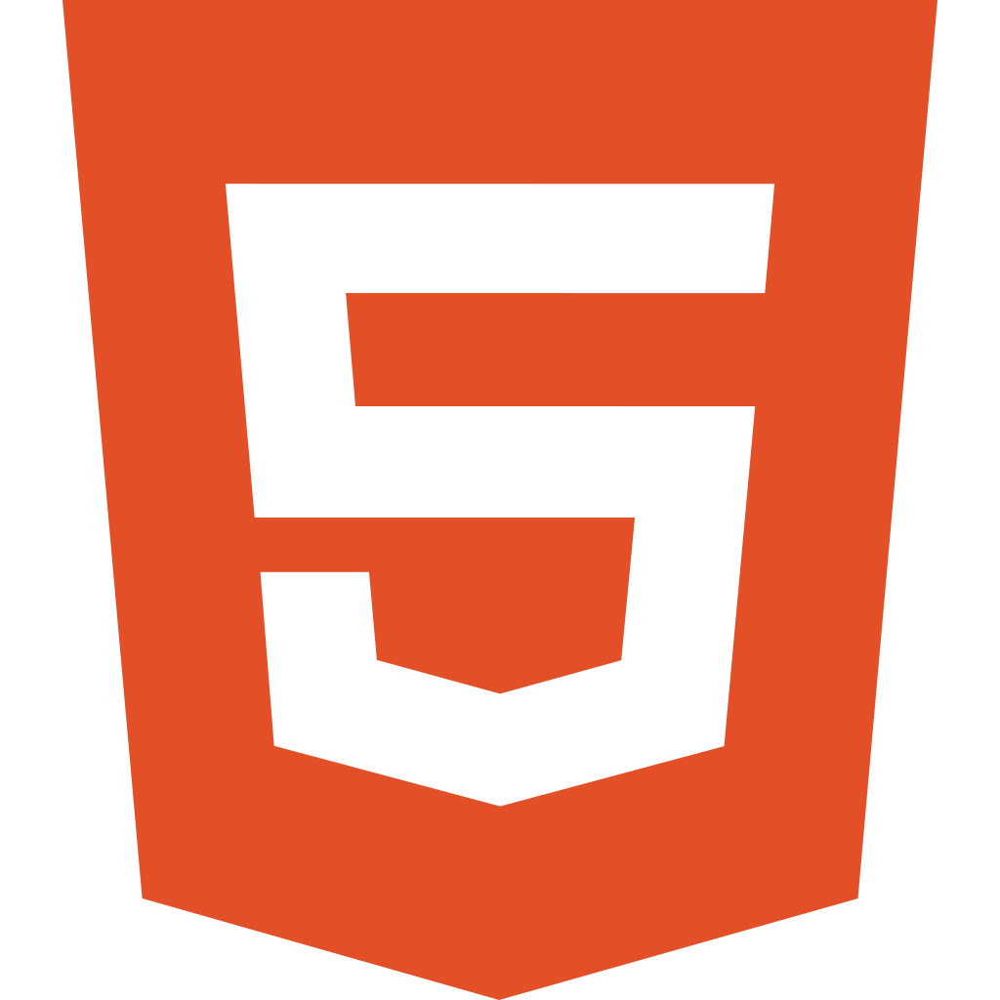
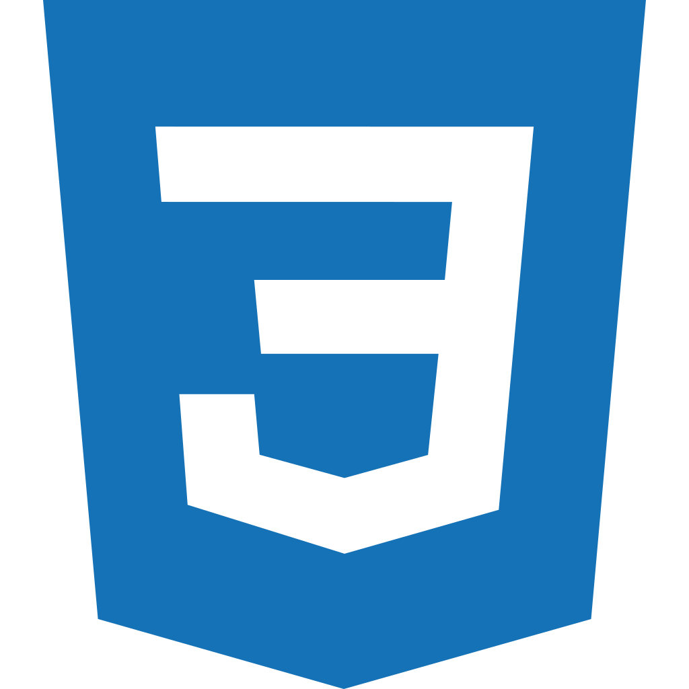
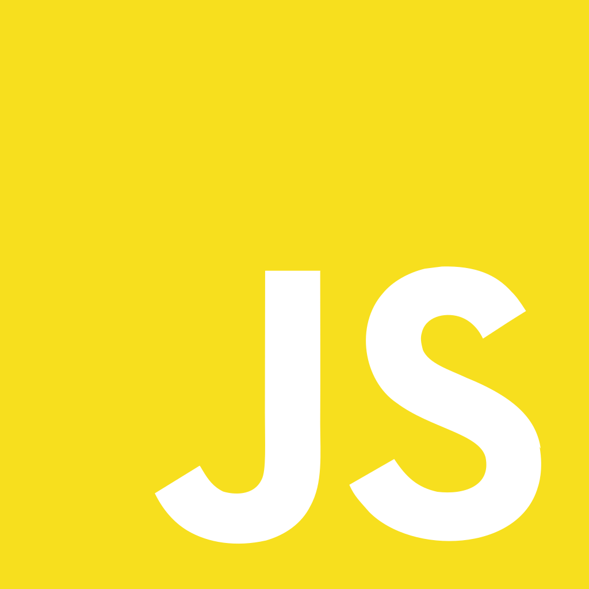

# Codes For Days

- 👋 Hi, I’m @knznsmn
- 👀 I’m interested in coding...
- 🌱 I’m currently learning JavaScript and C/C++...

## :hammer_and_wrench:

  &nbsp;
  &nbsp;
  &nbsp;

## Currently Learning These Cool Stuff:

  &nbsp;
  &nbsp;
  &nbsp;

<!---
knznsmn/knznsmn is a ✨ special ✨ repository because its `README.md` (this file) appears on your GitHub profile.
You can click the Preview link to take a look at your changes.
--->
